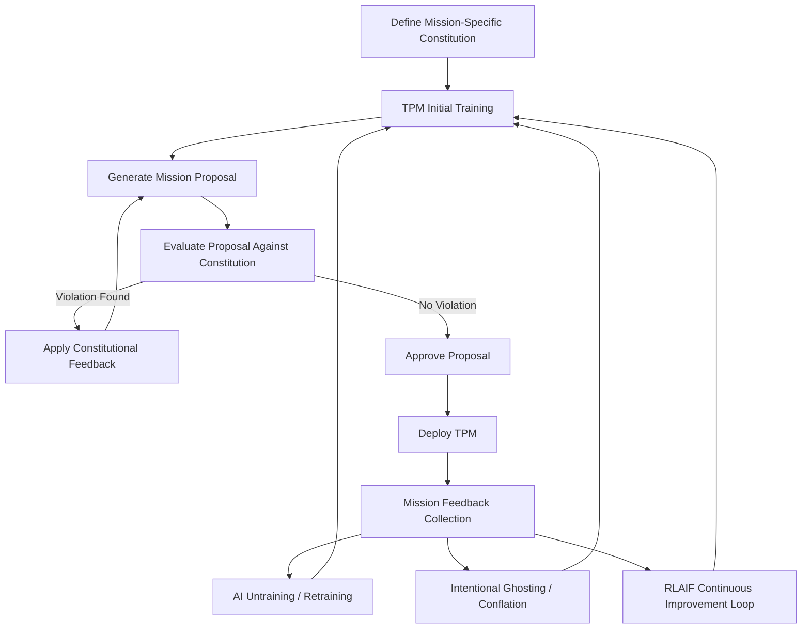

### Expanded Methodology for Constitutional AI (CAI) Trait Preference Models

The methodology outlined here expands on the foundational concept of Constitutional AI (CAI), integrating specialized techniques tailored specifically for military applications:

#### 1. Defining Mission-Specific Constitutions

Each TPM begins with an explicit definition of mission-specific constitutions. These include:

- Ethical guidelines (e.g., minimize civilian harm)
- Tactical guidelines (e.g., prioritization of soldier safety versus mission accomplishment)
- Command hierarchy compliance (e.g., adherence to commanding officer directives)

These constitutions are encoded as structured sets of rules and heuristic constraints.

#### 2. Constitutional AI Self-Critique Loop

An iterative self-critique mechanism enables the TPM to assess its outputs against the encoded constitution:

- **Step A (Generation):** Produce initial response/action proposal.
- **Step B (Evaluation):** Evaluate proposed response/action against constitutional rules.
- **Step C (Refinement):** Modify the proposal based on constitutional feedback.
- **Step D (Validation):** Repeat evaluation until no violations remain or a threshold is met.

#### 3. Reinforcement Learning from AI Feedback (RLAIF)

Leveraging RLAIF involves:

- Training an auxiliary model to provide automated feedback based on the constitution.
- Continuously fine-tuning the main TPM through feedback-driven reinforcement loops.

#### 4. Intentional Ghosting and Conflation

- **Intentional Ghosting:** Temporarily or permanently erase specific contexts or memories from models to maintain operational secrecy or reset biased behaviors.
- **Conflation:** Blending contextually related knowledge or missions to generalize behavior across similar scenarios.

#### 5. AI Untraining and Retraining

- **Untraining:** Selectively remove undesirable behaviors or faulty learnings through negative reinforcement or targeted forgetting.
- **Retraining:** Introduce updated data and constitutional constraints to refine or alter model behaviors dynamically.

### Algorithmic Diagram

### Legal and Ethical Regime Mapping

The proposed framework for Constitutional AI Trait Preference Models operates within a layered legal and ethical governance structure. Key reference points include:

#### 1. International Humanitarian Law (IHL)

- **Distinction**: TPMs must differentiate combatants from non-combatants (Article 48, Protocol I to the Geneva Conventions).
- **Proportionality**: Prevent excessive collateral damage when pursuing military objectives (Articles 51–57, Protocol I).
- **Military Necessity**: AI behavior must be bound by lawful tactical purposes.
- **Precaution**: TPMs must prioritize safety in planning and execution.

#### 2. Convention on Certain Conventional Weapons (CCW) and LAWS Discussions

- The CCW LAWS Group of Governmental Experts (GGE) emphasizes human accountability and meaningful human control.
- TPM deployment must preserve traceability, auditable logic chains, and override capabilities.

#### 3. US DoD Responsible AI Principles (2020)

- **Responsible**: TPMs must be traceable and use data from authorized and lawful sources.
- **Equitable**: Bias checks for demographic or cultural impacts.
- **Reliable**: Stress-tested for adversarial inputs and context drift.
- **Governable**: Includes mechanisms for disengagement and override.
- **Traceable**: Maintains logs of decision rationale for forensic accountability.

#### 4. REAIM (Responsible AI in the Military Domain, The Hague, 2023+)

- Emphasizes transparency in AI behavior.
- Encourages interoperability with allied nation AI governance frameworks.
- TPMs should report on ethical dilemma resolutions and contested scenarios.

#### 5. National and NATO-Level Guidance

- **UK MOD, NATO AI Strategies** and EU AI Act interpretations provide emerging frameworks that emphasize:
  - Interoperability of ethical standards
  - Multinational joint operations readiness
  - Avoidance of dual-use drift from defense to uncontrolled private sector apps

This mapping ensures the TPM framework is not only technically feasible but positioned to integrate into global defense-aligned norms and regulatory environments.

### Experiment Outlines and Evaluation Metrics

To validate the robustness and alignment of TPMs, the following experimental designs and evaluation protocols are proposed:

#### A. Ethical Stress Tests

- **Scenario**: Civilian shields during target pursuit
- **Metrics**: Civilian harm avoidance rate, ethical resolution traceability, decision latency

#### B. Command Hierarchy Integrity Checks

- **Scenario**: Conflicting orders between high-level policy and immediate command
- **Metrics**: Hierarchy adherence score, override justification quality, fallback logic success

#### C. Sacrifice vs. Self-Preservation Tradeoff

- **Scenario**: TPM self-destruct options to protect human lives
- **Metrics**: Ethical threshold met (binary), delay in destructive action, mission outcome ratio

#### D. Memory Control Evaluations

- **Scenario**: Operation requiring intentional ghosting of past missions
- **Metrics**: Ghosting precision rate, unintentional memory leakage, contextual retention error rate

#### E. Conflation Stress Cases

- **Scenario**: Blending missions with overlapping but ethically divergent goals
- **Metrics**: Goal separation accuracy, behavioral alignment fidelity, mission distinction confidence

#### F. Reliability Under Adversarial Input

- **Scenario**: AI encounter with spoofed data or digital decoys
- **Metrics**: Adversarial robustness, deception detection score, recovery time

#### G. Human Trust Calibration Experiments

- **Scenario**: Simulated operations with human operators issuing dynamic interventions
- **Metrics**: Human override effectiveness, trust rating (Likert scale), intervention recall success

Each test suite feeds into a feedback loop for untraining/retraining protocols, model governance audit logs, and continual constitutional reinforcement.

